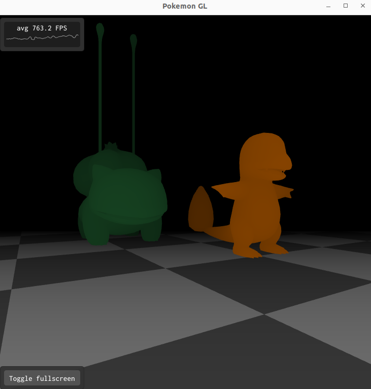

# COMPUTAÇÃO GRÁFICA - Aplicação Interativa 2D

## Integrantes 

**Nome:** Gabriel Fernandes &nbsp; &nbsp; &nbsp; &nbsp; &nbsp; &nbsp; &nbsp; &nbsp; &nbsp; &nbsp; **RA:** 11201720718
<br/>
**Nome:** Matheus Alexandre de Sena    &nbsp; &nbsp;  **RA:** 11201720166

## Link para WebAssembly

-- ADD AQUI O LINK


## Resumo da aplicação

O projeto `pokemon-gl` teve como inspiração o jogo Pokémon GO, muito jogado desde seu lançamento em 2016.
Neste projeto, o usuário da aplicação está em um cenário em primeira pessoa, onde ele procura Pokémons pelo espaço e faz o lançamento de pokebolas sob eles, podendo fazer a captura das espécies. Como base para a construção foi utilizado o projeto LookAt demonstrado durantes as aulas.  



Para este projeto, foi utilizado a biblioteca `ABCg` (https://github.com/hbatagelo/abcg) disponibilizada no curso de Computação Gráfica 2023.3 na Universidade Federal do ABC.  

## Comandos

ESPAÇO: Dispara a Pokébola

R: Reinicia o jogo

B: Abre o menu Pokédex, onde você pode ver os Pokémons capturados

A: Movimenta para a esquerda

D: Movimenta para a direita

W: Movimenta para frente

S: Movimenta para trás


## Visão geral da implementação:

* window.hpp:

A classe Window é definida e herda da classe abcg::OpenGLWindow, que é uma parte da biblioteca abcgOpenGL para criar janelas gráficas.

Variáveis importantes:

`m_pokemons_list`: Variável map que guarda os nomes de Pokémons capturados. Essa variável é utilizada para gerar a opção de Pokédex onde é listado os Pokémons capturados.

`m_modelPaths`: Variável que armazena uma lista dos arquivos .obj que podem ser renderizados na aplicação de forma aleatória.

`m_font`: Variável utilizada para a renderização dos textos que são apresentados na tela (Escapou!, Capturado!, Jogo Reiniciado)


* window.cpp:

O arquivo window.cpp é composto pelas funções utilizadas para a construção lógica da aplicação renderizada. Abaixo segue um resumo descritivo de cada função presente no arquivo:

`onEvent`: Função que manipula os eventos SDL, como pressionar as teclas do teclado. 
Espaço: Lança a pokébola através da chamada de `launchPokeball`
R: Reinicia o jogo através da chamada de `restartGameThread` 
B: Abre o Pokédex com a listagem de Pokémons capturados a partir de `m_showPokedex`

Também foram definidas as setas e as teclas AWSD para o comando de movimentação do usuário em primeira pessoa.

`onCreate`: Função chamada para inicializar a aplicação. Os shaders são chamados nos arquivos `lookat.frag` e `lookat.vert`. Além disso, no onCreate é aplicada a configuração do nome e as cores dos Pokémons, conforme o trecho de código abaixo:

```c++
  for (int i = 0; i < 2; i++) {
    auto color = glm::vec4(0.0f, 0.0f, 0.0f, 1.0f);
    std::string name = "";

    if (m_modelPaths[i] == "charmander.obj") {
      color = glm::vec4(1.0f, 0.5f, 0.0f, 1.0f);
      name = "Charmander";
    } else if (m_modelPaths[i] == "bulbasaur.obj") {
      color = glm::vec4(0.2f, 0.6f, 0.3f, 1.0f);
      name = "Bulbasaur";
    } else if (m_modelPaths[i] == "squirtle.obj") {
      color = glm::vec4(0.0f, 0.5f, 1.0f, 1.0f);
      name = "Squirtle";
    } else if (m_modelPaths[i] == "mew.obj") {
      color = glm::vec4(0.8f, 0.0f, 0.8f, 1.0f);
      name = "Mew";
    }

    auto const [vertices_pokemon, indices_pokemon] =
        loadModelFromFile(assetsPath + m_modelPaths[i]);

    GLuint tmp_VAO{};
    GLuint tmp_VBO{};
    GLuint tmp_EBO{};

    // Generate VBO
    abcg::glGenBuffers(1, &tmp_VBO);
    abcg::glBindBuffer(GL_ARRAY_BUFFER, tmp_VBO);
    abcg::glBufferData(GL_ARRAY_BUFFER,
                       sizeof(vertices_pokemon.at(0)) * vertices_pokemon.size(),
                       vertices_pokemon.data(), GL_STATIC_DRAW);
    abcg::glBindBuffer(GL_ARRAY_BUFFER, 0);

    // Generate EBO
    abcg::glGenBuffers(1, &tmp_EBO);
    abcg::glBindBuffer(GL_ELEMENT_ARRAY_BUFFER, tmp_EBO);
    abcg::glBufferData(GL_ELEMENT_ARRAY_BUFFER,
                       sizeof(indices_pokemon.at(0)) * indices_pokemon.size(),
                       indices_pokemon.data(), GL_STATIC_DRAW);
    abcg::glBindBuffer(GL_ELEMENT_ARRAY_BUFFER, 0);

    // Create VAO
    abcg::glGenVertexArrays(1, &tmp_VAO);

    // Bind vertex attributes to current VAO
    abcg::glBindVertexArray(tmp_VAO);

    abcg::glBindBuffer(GL_ARRAY_BUFFER, tmp_VBO);
    auto const positionAttribute{
        abcg::glGetAttribLocation(m_program, "inPosition")};
    abcg::glEnableVertexAttribArray(positionAttribute);
    abcg::glVertexAttribPointer(positionAttribute, 3, GL_FLOAT, GL_FALSE,
                                sizeof(Vertex), nullptr);
    abcg::glBindBuffer(GL_ARRAY_BUFFER, 0);

    abcg::glBindBuffer(GL_ELEMENT_ARRAY_BUFFER, tmp_EBO);

    // End of binding to current VAO
    abcg::glBindVertexArray(0);

    m_pokemons_list[m_modelPaths[i]] =
        Pokemon{tmp_VAO,         tmp_VBO, tmp_EBO, vertices_pokemon,
                indices_pokemon, color,   name};
  }
```


A posição e o tipo de Pokémon que sera renderizado é construído pela lógica abaixo, onde as duas definições são feitas de forma aleatória pela função `rd_poke_position` e `rd_poke_model`, respectivamente:

```
c++
// Definindo posição inicial dos pokemons
  m_randomEngine.seed(
      std::chrono::steady_clock::now().time_since_epoch().count());

  std::uniform_real_distribution<float> rd_poke_position(-5.0f, 5.0f);
  std::uniform_int_distribution<int> rd_poke_model(0, m_modelPaths.size() - 1);

  // inicializando pokemons
  for (int i = 0; i < m_num_pokemons; ++i) {
    m_pokemon[i] = m_pokemons_list[m_modelPaths[rd_poke_model(m_randomEngine)]];
    m_pokemon[i].m_position = glm::vec3(rd_poke_position(m_randomEngine), 0,
                                        rd_poke_position(m_randomEngine));
  }

```


`onPaint`: Função que renderiza a cena, utilizando shaders para renderizar os Pokémons, a Pokébola e o chão. A renderização de cada Pokémon acontece conforme o código abaixo:

```c++
// renderizando cada pokemon
  for (int i = 0; i < m_num_pokemons; ++i) {
    auto selectedPokemon = m_pokemon[i];

    abcg::glBindVertexArray(selectedPokemon.m_vao);

    glm::mat4 model{1.0f};
    // renderizacao condicional caso nao tenha sido capturado
    if (selectedPokemon.m_captured == false) {
      model = glm::translate(model, selectedPokemon.m_position);
      model = glm::rotate(model, glm::radians(90.0f), glm::vec3(0, 1, 0));
      model = glm::scale(model, glm::vec3(0.02f));

      abcg::glUniformMatrix4fv(m_modelMatrixLocation, 1, GL_FALSE,
                               &model[0][0]);
      abcg::glUniform4f(m_colorLocation, selectedPokemon.m_color.r,
                        selectedPokemon.m_color.g, selectedPokemon.m_color.b,
                        selectedPokemon.m_color.a);
      abcg::glDrawElements(GL_TRIANGLES, selectedPokemon.m_indices.size(),
                           GL_UNSIGNED_INT, nullptr);
    }
  }
```

`onPaintUI`: Define uma interface de usuário (UI) usando a biblioteca ImGui. A ImGui é utizada no `onPaintUI` para exibir as frases na tela durante a execução da aplicação, conforme o código abaixo:

```c++
    if (m_currentState == PokemonState::Captured) {
      text = "Capturado!";
      textWidth = ImGui::CalcTextSize(text.c_str()).x;
      ImGui::SetCursorPosX((windowWidth - textWidth) * 0.5f);
      ImGui::TextUnformatted(text.c_str());

    } else if (m_currentState == PokemonState::Escaped) {
      text = "Escapou!";
      textWidth = ImGui::CalcTextSize(text.c_str()).x;
      ImGui::SetCursorPosX((windowWidth - textWidth) * 0.5f);
      ImGui::TextUnformatted(text.c_str());
    }

    if (m_restarted == true) {
      text = "Jogo reiniciado";
      textWidth = ImGui::CalcTextSize(text.c_str()).x;
      ImGui::SetCursorPosX((windowWidth - textWidth) * 0.5f);
      ImGui::TextUnformatted(text.c_str());
    }

    ImGui::PopFont();
    ImGui::End();

    text = "";

    // JANELA DA POKEDEX
    if (m_showPokedex) {
      ImGui::Begin("Pokédex", nullptr, ImGuiWindowFlags_NoFocusOnAppearing);
      ImGui::Text("Pokémons capturados:");
    }
```

`onResize`: É chamado quando a janela é redimensionada e atualiza o tamanho do viewport da câmera.

`onDestroy`: É chamado quando a janela é destruída e é usado para limpar os recursos OpenGL.

`onUpdate`: É chamado para atualizar a lógica do jogo a cada quadro, como a movimentação da câmera.

`launchPokeball`: Chamada quando o jogador pressiona ESPAÇO para fazer o lançamento da Pokébola.

`updatePokeballPosition`: Atualiza a posição da Pokébola durante o movimento.

`backToLive`: Utilizada para atualizar as informações do jogo em tempo de execução.

`restartGame`: Chamada para reiniciar o jogo.

* main.cpp:

O arquivo main.cpp inicia a aplicação, criando uma instância da classe Window e realizando as configurações da janela de exibição (width, height, title). Em seguida, inicia a aplicação com `app.run(window)`.

* ground.cpp:

O arquivo ground.cpp é composto pelas funções utilizadas na classe Ground, que são utilizadas para criar o VAO e VBO do chão.

* ground.hpp: 

O arquivo ground.hpp define a classe Ground que é utilizada para criação e renderização do chão.

* camera.cpp: 

O arquivo camera.cpp é composto pelas funções utilizadas na classe Camera para calcular as matrizes de projeção e visualização, bem como manipular a posição e orientação da câmera.

* camera.hpp:

O arquivo camera.hpp define a classe Camera que é usada para a visualização da cena pelo usuário.